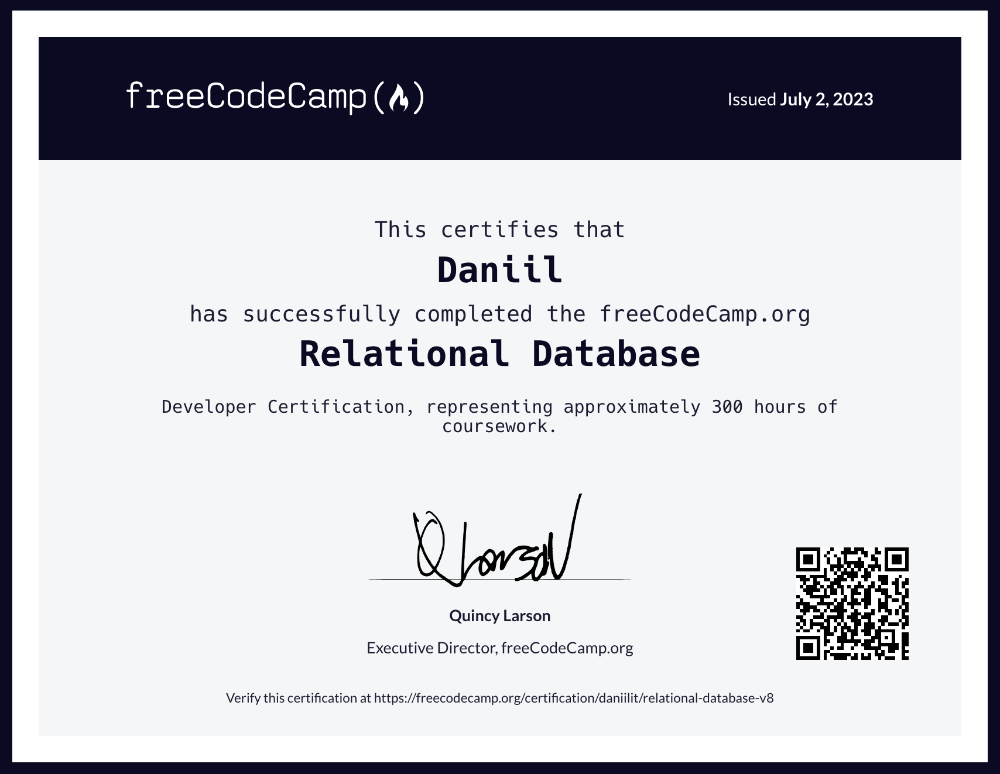

# Relational Database

Здесь собраны выполненные задания из курса "Relational Database" [freeCodeCamp.org](https://www.freecodecamp.org/learn/relational-database/).

Завершающий курс проект - [Number Guessing Game](./number_guessing_game).
